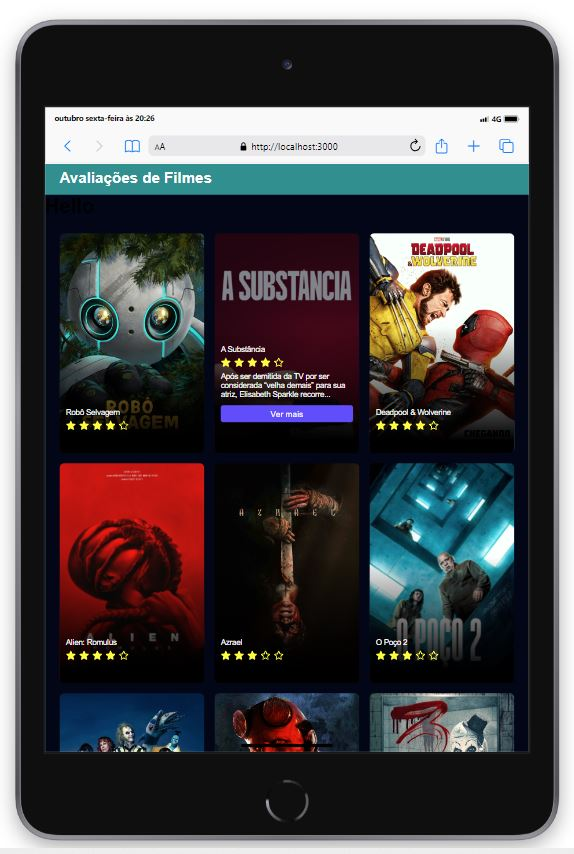

# Valiações de filmes  - API do TMDB

## Descrição 📋
Esse projeto foi feito para colocar em praticas técnicas aprendidas recentemente, além de testar novas tecnologias que não tinha testado ainda como:

* Next.js
* Axios
* SCSS

Seu funcionamento se consiste em ao passar o mouse em cima parece a quantidade de estrelas do filmes e um resumo de 100 caracter e com possibilidade de clicar no botão dever mais, o foco central do projeto foi a manipulação da API e como trabalhar seus dados consciliando as tecnicas usadas.

## Tecnologias usadas 💻
As tecnologias e tecnicas usadas são:

* Next.js
* Axios
* React-icons
* React loading

## Dificuldades 🛠
A maior dificuldade foi trabalhar com tecnologias diferentes das habituais, mas nada que o nosso anjo GOOGLE 👼 nao resolva rsrs

 
  
   

